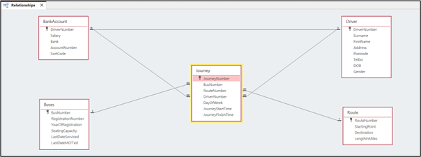
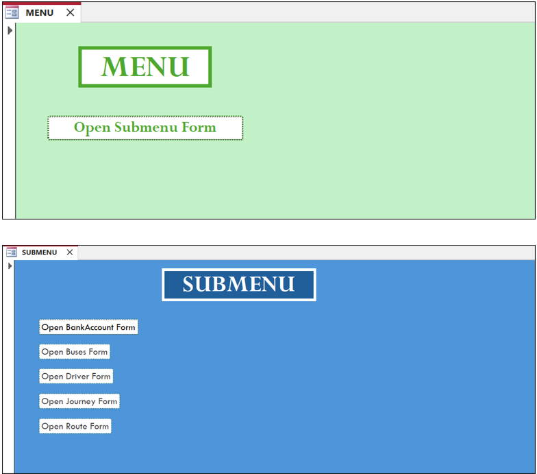
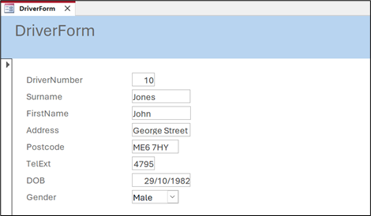
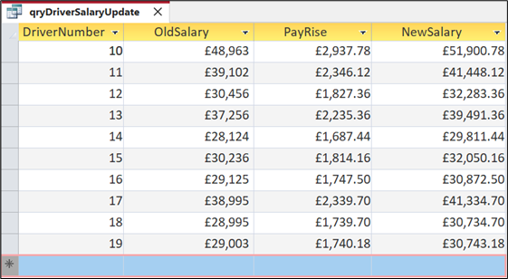
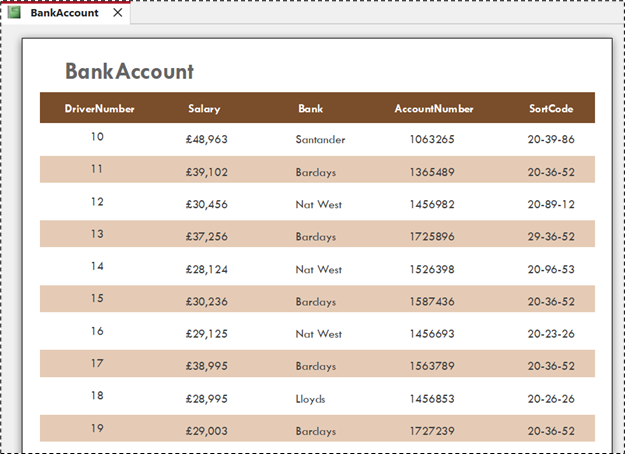
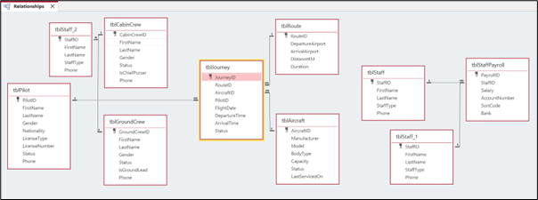
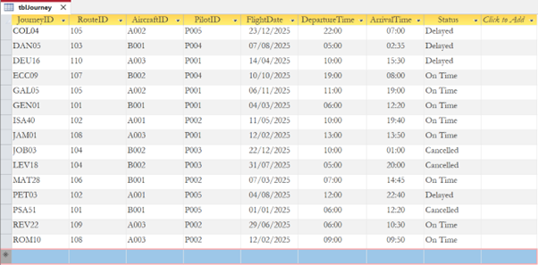

# Access-database-systems
Relational database projects developed in Microsoft Access, demonstrating database design, relationships, queries, forms, reports and data management.

# Relational Database Systems – Microsoft Access

## Overview

This project demonstrates the design and implementation of relational database systems using Microsoft Access.

The projects involved analysing business requirements and creating database solutions to organise, manage and retrieve information efficiently.

## Project 1 – SpeedyTravel Buses

### Problem

SpeedyTravel Buses is a fictional transport company operating five routes in the South of England with 12 buses and 10 drivers.

The company required a database system to efficiently manage its operational and employee information.

### Solution

I designed and implemented a relational database in Microsoft Access to organise the company's information and provide users with efficient ways to enter, retrieve and analyse data.

### Technologies

- Microsoft Access
- Relational database design
- Tables
- Relationships
- Queries
- Forms
- Reports
- Calculated fields

### Key Features

- Designed relational database tables to organise business information
- Established relationships between tables
- Created a data-entry form for the Human Resources department
- Created queries using multiple tables
- Developed calculations to determine the impact of a 6% salary increase on individual drivers
- Created formatted reports
- Developed menu and sub-menu navigation

## Project 2 – Skyline Airline Database

### Problem

Skyline is a fictional UK-based airline requiring a database system to support its operations.

The business needed to manage information relating to aircraft, airports, routes, pilots, cabin crew and other employees while allowing for future expansion.

### Solution

I analysed the business requirements and designed a relational database system using Microsoft Access, with SQL used to support database operations and information retrieval.

### Key Features

- Analysed business requirements
- Designed relational database structures
- Created tables and relationships
- Managed aircraft, routes, airports and employee information
- Used queries to retrieve and manipulate information
- Applied SQL to support database operations
- Considered scalability and future business requirements
- Documented and evaluated the project using Microsoft Word

## Screenshots

### SpeedyTravel Database Relationships

### SpeedyTravel Database Menus and Sub-menus

### Data Entry Form

### Salary Calculation Query

### Database Report

### Skyline Airline Database Relationships

### Skyline Airline Database

## What I Learned

These projects strengthened my understanding of relational database design and how technical solutions can be developed around real business requirements.

I gained practical experience designing relationships between data, developing queries, creating user-facing forms and reports, and using databases to support business processes.

The Skyline project also strengthened my ability to translate a business scenario into a technical solution while considering scalability and future requirements.
